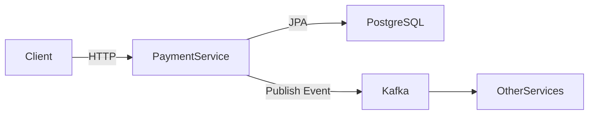

# 📦 Payment Service – FIAP Restaurant

Microsserviço responsável pelo processamento e persistência de pagamentos no ecossistema **Restaurant FIAP**.

Este serviço foi desenvolvido seguindo boas práticas de arquitetura de microsserviços, versionamento de banco de dados, integração assíncrona e organização profissional de configuração de ambientes.

---

# 🏗 Visão Arquitetural

O serviço está estruturado como um microsserviço independente com:

* API REST
* Persistência em PostgreSQL
* Versionamento de schema com Flyway
* Comunicação assíncrona via Kafka
* Healthchecks de infraestrutura
* Integração contínua com GitHub Actions

---

## 🔎 Diagrama Simplificado



---

# 🛠 Stack Tecnológica

* Java 21
* Spring Boot 4
* Spring Data JPA
* PostgreSQL 16
* Flyway
* Apache Kafka
* Docker / Docker Compose
* GitHub Actions
* Maven

---

# 🗄 Banco de Dados

Migration inicial:

`src/main/resources/db/migration/V1__init.sql`

```sql
create table payments (
  id uuid primary key,
  order_id uuid not null,
  status varchar(30) not null,
  amount numeric(19,2) not null,
  created_at timestamptz not null,
  updated_at timestamptz not null
);

create unique index uk_payments_order_id on payments(order_id);
```

O schema é gerenciado exclusivamente via **Flyway**.

O Hibernate está configurado apenas para validação:

```
spring.jpa.hibernate.ddl-auto=validate
```

---

# ⚙️ Configuração de Ambiente (.env)

O projeto utiliza variáveis de ambiente com fallback tanto no `application.yaml` quanto no `docker-compose.yml`.

## 📌 Arquivos

* `.env` → **não versionado** (configuração local)
* `.env.example` → **versionado** (modelo para novos ambientes)

## 🔧 Como configurar

1️⃣ Copie o arquivo de exemplo:

```bash
cp .env.example .env
```

No Windows:

```bash
copy .env.example .env
```

2️⃣ Ajuste as variáveis conforme necessário.

Caso o `.env` não exista, valores padrão serão utilizados automaticamente.

Exemplo de fallback no `application.yaml`:

```yaml
url: ${SPRING_DATASOURCE_URL:jdbc:postgresql://localhost:5432/paymentdb}
```

Isso garante:

* Execução simples para avaliação
* Flexibilidade para múltiplos ambientes
* Organização profissional de configuração

---

# 🐳 Execução Local

## 1️⃣ Subir infraestrutura

```bash
docker compose up -d
```

Serviços disponíveis:

| Serviço    | Porta |
| ---------- | ----- |
| PostgreSQL | 5432  |
| Kafka      | 9092  |
| Kafka UI   | 8088  |

Kafka UI:

```
http://localhost:8088
```

---

## 2️⃣ Executar aplicação

```bash
mvn spring-boot:run
```

Aplicação disponível em:

```
http://localhost:8083
```

---

# 🧪 Testes

Executar testes:

```bash
mvn test
```

Build completo:

```bash
mvn verify
```

O pipeline CI executa automaticamente:

* Subida de PostgreSQL
* Validação Flyway
* Execução de testes

---

# 🔄 Integração Contínua

Workflow localizado em:

```
.github/workflows/ci.yml
```

O pipeline:

* Configura Java 21
* Sobe PostgreSQL
* Executa `mvn verify`
* Garante que migrations e testes estejam válidos

---

# 📂 Estrutura do Projeto

```
src
 ├── main
 │   ├── java
 │   └── resources
 │        ├── application.yaml
 │        └── db/migration
 └── test
```

---

# 📈 Próximas Evoluções

* Implementação da entidade `Payment`
* Camada Domain
* Use Cases
* Controller REST
* Publicação de eventos Kafka
* Testes de integração com Testcontainers
* Aplicação de princípios de Clean Architecture

---

# 🎓 Contexto Acadêmico

Projeto desenvolvido como parte do curso:

**Pós-Graduação em Arquitetura e Desenvolvimento Java – FIAP**

---

# 💡 Decisões Técnicas Importantes

* Flyway como fonte única de versionamento de schema
* Hibernate configurado apenas para validação
* Kafka configurado com listeners internos e externos
* Docker Compose parametrizado com fallback de variáveis
* Separação adequada entre `.env` e `.env.example`
* CI configurado desde o início do projeto
