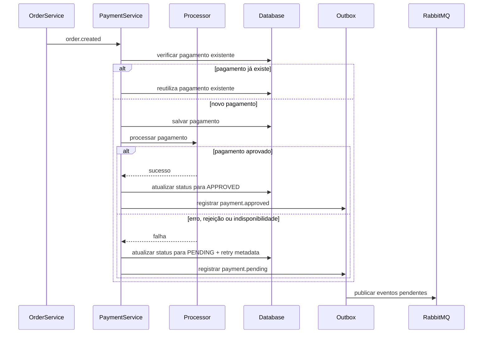

# 📦 Payment Service – FIAP Restaurant

Microsserviço responsável pelo **processamento de pagamentos** no ecossistema **Restaurant FIAP**.

O serviço consome eventos de criação de pedidos, processa pagamentos por meio de um processador externo, persiste o estado do pagamento, registra eventos em **outbox** e publica eventos com o resultado do processamento.

O projeto foi desenvolvido com foco em:

- **Clean Architecture**
- **Event-Driven Architecture**
- **resiliência**
- **idempotência**
- **testabilidade**
- **outbox pattern**
- **separação clara entre domínio e infraestrutura**

---

# 📑 Sumário

- [📦 Payment Service – FIAP Restaurant](#-payment-service--fiap-restaurant)
- [📑 Sumário](#-sumário)
- [🎯 Objetivo do Serviço](#-objetivo-do-serviço)
- [🏗 Arquitetura](#-arquitetura)
  - [📐 Clean Architecture Diagram](#-clean-architecture-diagram)
- [📡 Arquitetura Orientada a Eventos](#-arquitetura-orientada-a-eventos)
  - [🐇 Topologia RabbitMQ](#-topologia-rabbitmq)
  - [🔗 Bindings principais](#-bindings-principais)
- [🔄 Fluxo de Processamento do Pagamento](#-fluxo-de-processamento-do-pagamento)
- [📤 Padrão Outbox](#-padrão-outbox)
  - [Como funciona](#como-funciona)
  - [Benefícios](#benefícios)
  - [🔁 Evolução de eventos do mesmo pagamento](#-evolução-de-eventos-do-mesmo-pagamento)
- [🌐 API HTTP](#-api-http)
  - [Endpoints disponíveis](#endpoints-disponíveis)
  - [Exemplos cURL](#exemplos-curl)
  - [Tratamento de erros](#tratamento-de-erros)
  - [Observação sobre idempotência por mensagem](#observação-sobre-idempotência-por-mensagem)
- [🌐 Integração com Processador de Pagamentos](#-integração-com-processador-de-pagamentos)
  - [Endpoints utilizados](#endpoints-utilizados)
  - [Fluxo de integração](#fluxo-de-integração)
  - [Observações importantes](#observações-importantes)
- [💰 Contrato Monetário](#-contrato-monetário)
  - [Representação interna do domínio](#representação-interna-do-domínio)
  - [Representação exigida pelo-procpag](#representação-exigida-pelo-procpag)
  - [Convenção adotada](#convenção-adotada)
  - [Regra de validação](#regra-de-validação)
  - [Decisão arquitetural](#decisão-arquitetural)
- [🛡 Resiliência](#-resiliência)
- [🔁 Retry de Pagamentos Pendentes](#-retry-de-pagamentos-pendentes)
  - [Fluxo esperado](#fluxo-esperado)
  - [Política de retry](#política-de-retry)
  - [Configuração](#configuração)
  - [Cenário de falha definitiva](#cenário-de-falha-definitiva)
- [📡 Eventos do Sistema](#-eventos-do-sistema)
  - [Evento Consumido](#evento-consumido)
  - [Eventos Publicados](#eventos-publicados)
- [🧠 Regras de Negócio](#-regras-de-negócio)
  - [Idempotência](#idempotência)
  - [Comportamento em caso de mensagem duplicada](#comportamento-em-caso-de-mensagem-duplicada)
  - [Falha definitiva](#falha-definitiva)
  - [Regra adicional de valor monetário](#regra-adicional-de-valor-monetário)
- [📊 Observabilidade](#-observabilidade)
  - [Métricas registradas](#métricas-registradas)
  - [Logs relevantes](#logs-relevantes)
- [🗄 Banco de Dados](#-banco-de-dados)
  - [Migration inicial](#migration-inicial)
  - [Migration de idempotência](#migration-de-idempotência)
  - [Migration de metadados de retry](#migration-de-metadados-de-retry)
  - [Migration de outbox](#migration-de-outbox)
- [🧪 Cenários Validados](#-cenários-validados)
- [🧪 Validação Manual End-to-End via RabbitMQ](#-validação-manual-end-to-end-via-rabbitmq)
  - [Objetivo](#objetivo)
  - [Passos](#passos)
  - [Cenário adicional: reenvio da mesma mensagem](#cenário-adicional-reenvio-da-mesma-mensagem)
- [🛠 Stack Tecnológica](#-stack-tecnológica)
- [📂 Estrutura do Projeto](#-estrutura-do-projeto)
- [🐳 Execução Local](#-execução-local)
  - [Pré-requisitos](#pré-requisitos)
  - [Subida local passo a passo](#subida-local-passo-a-passo)
- [⚙ Configuração Principal](#-configuração-principal)
- [🧪 Perfil de Teste](#-perfil-de-teste)
- [🧪 Testes](#-testes)
- [🧭 Architecture Decision Records](#-architecture-decision-records)
  - [ADR-001 — Clean Architecture](#adr-001--clean-architecture)
  - [ADR-002 — Comunicação Assíncrona com RabbitMQ](#adr-002--comunicação-assíncrona-com-rabbitmq)
  - [ADR-003 — Idempotência](#adr-003--idempotência)
  - [ADR-004 — Resiliência na Integração Externa](#adr-004--resiliência-na-integração-externa)
  - [ADR-005 — Contrato Monetário com o Processador Externo](#adr-005--contrato-monetário-com-o-processador-externo)
  - [ADR-006 — Publicação de Eventos via Outbox](#adr-006--publicação-de-eventos-via-outbox)

---

# 🎯 Objetivo do Serviço

O `payment-service` é responsável por:

- consumir eventos de criação de pedido
- processar pagamentos
- persistir o estado do pagamento
- consultar pagamentos por `orderId`
- evitar duplicidade de processamento
- lidar com falhas transitórias do processador externo
- reprocessar pagamentos pendentes
- marcar pagamentos como `FAILED` ao atingir o limite de tentativas
- registrar eventos em **outbox**
- publicar eventos de pagamento no RabbitMQ

---

# 🏗 Arquitetura

O serviço segue os princípios da **Clean Architecture (Robert C. Martin)**, promovendo:

- baixo acoplamento
- alta testabilidade
- independência de frameworks
- separação clara entre domínio, casos de uso e infraestrutura

As dependências sempre apontam **para o domínio**.

---

## 📐 Clean Architecture Diagram

```mermaid
flowchart TB

Frameworks[Spring Boot / RabbitMQ / PostgreSQL / Procpag]
Adapters[Interface Adapters]
UseCases[Use Cases]
Entities[Domain Entities]

Frameworks --> Adapters
Adapters --> UseCases
UseCases --> Entities
````

---

# 📡 Arquitetura Orientada a Eventos

O sistema utiliza **mensageria assíncrona** com **RabbitMQ** para comunicação entre microsserviços.

Além disso, o serviço adota **Outbox Pattern** para desacoplar a persistência do pagamento da publicação do evento no broker.

```mermaid
flowchart LR

OrderService -->|order.created| PaymentService

PaymentService -->|HTTP| ExternalProcessor
PaymentService -->|persistência| PostgreSQL
PaymentService -->|grava evento pendente| Outbox[(payment_outbox)]

Outbox -->|publisher| RabbitMQ

RabbitMQ -->|payment.approved| OrderService
RabbitMQ -->|payment.pending| OrderService
RabbitMQ -->|payment.failed| OrderService
RabbitMQ --> OtherServices
```

---

## 🐇 Topologia RabbitMQ

### Exchanges

* `ex.order`
* `ex.payment`

### Routing keys

* `order.created`
* `payment.approved`
* `payment.pending`
* `payment.failed`

### Queue consumida pelo `payment-service`

* `payment.order.created`

### Queues auxiliares / debug

* `payment.approved.debug`
* `payment.pending.debug`
* `payment.failed.debug`

### Dead Letter Queues

* `payment.order.created.dlq`
* `payment.approved.debug.dlq`
* `payment.pending.debug.dlq`
* `payment.failed.debug.dlq`

---

## 🔗 Bindings principais

Os bindings principais da topologia são:

* `ex.order` + `order.created` → `payment.order.created`
* `ex.payment` + `payment.approved` → `payment.approved.debug`
* `ex.payment` + `payment.pending` → `payment.pending.debug`
* `ex.payment` + `payment.failed` → `payment.failed.debug`

As filas `.dlq` são utilizadas para inspeção e tratamento de mensagens que não puderam seguir o fluxo esperado.

---

# 🔄 Fluxo de Processamento do Pagamento



---

# 📤 Padrão Outbox

O serviço utiliza **Outbox Pattern** para garantir consistência entre a persistência do pagamento e a publicação do evento de saída.

## Como funciona

1. o caso de uso decide o estado imediato do pagamento
2. o pagamento é persistido
3. no mesmo fluxo, é criado um registro em `payment_outbox`
4. um publisher dedicado busca eventos pendentes
5. os eventos são publicados no RabbitMQ
6. após sucesso, o status do outbox é atualizado para `PUBLISHED`

## Benefícios

* reduz acoplamento entre banco e broker
* evita perda silenciosa de eventos
* permite retry de publicação
* melhora auditabilidade do fluxo assíncrono

---

## 🔁 Evolução de eventos do mesmo pagamento

Um mesmo pagamento pode gerar múltiplos registros em `payment_outbox` ao longo do seu ciclo de vida, desde que representem transições reais de estado.

Exemplos:

* `PENDING` → `APPROVED`
* `PENDING` → `FAILED`

Nesses casos:

* o `aggregate_id` permanece o mesmo, pois representa o mesmo pagamento
* cada transição relevante gera um novo evento de saída
* o histórico no outbox preserva a trilha de evolução do pagamento

Isso permite auditabilidade e rastreabilidade do fluxo completo.

---

# 🌐 API HTTP

O serviço também expõe endpoints REST para processamento manual e consulta de pagamentos.

## Endpoints disponíveis

| Método | Endpoint                    | Descrição                     |
| ------ | --------------------------- | ----------------------------- |
| POST   | `/payments/process`         | Processa um pagamento         |
| GET    | `/payments/order/{orderId}` | Busca pagamento por `orderId` |

---

## Exemplos cURL

### Processar pagamento

```bash
curl -X POST http://localhost:8083/payments/process \
  -H "Content-Type: application/json" \
  -d '{
    "orderId": 12345,
    "clientId": "550e8400-e29b-41d4-a716-446655440001",
    "amount": 120.00
  }'
```

### Buscar pagamento por `orderId`

```bash
curl http://localhost:8083/payments/order/12345
```

### Exemplo de resposta

```json
{
  "paymentId": "550e8400-e29b-41d4-a716-446655440010",
  "orderId": 12345,
  "clientId": "550e8400-e29b-41d4-a716-446655440001",
  "amount": 120.00,
  "status": "APPROVED",
  "createdAt": "2026-03-20T12:00:00Z",
  "updatedAt": "2026-03-20T12:00:01Z"
}
```

---

## Tratamento de erros

O serviço possui tratamento global de exceções para:

* `PaymentNotFoundException` → `404 Not Found`
* `IllegalArgumentException` → `400 Bad Request`
* `MethodArgumentNotValidException` → `400 Bad Request`

### Exemplo de erro de validação

```json
{
  "timestamp": "2026-03-20T12:00:00Z",
  "status": 400,
  "error": "Bad Request",
  "message": "Erro de validação",
  "fields": {
    "amount": "amount deve ter no máximo 2 casas decimais",
    "clientId": "clientId é obrigatório",
    "orderId": "orderId é obrigatório"
  }
}
```

### Exemplo de pagamento não encontrado

```json
{
  "timestamp": "2026-03-20T12:00:00Z",
  "status": 404,
  "error": "Not Found",
  "message": "Pagamento não encontrado para o orderId: 99999"
}
```

---

## Observação sobre idempotência por mensagem

A tabela `processed_messages` é utilizada exclusivamente no fluxo assíncrono de consumo do evento `order.created`.

Chamadas manuais ao endpoint HTTP `POST /payments/process`:

* não utilizam `messageId`
* não representam consumo de evento do broker
* não passam pela proteção baseada em `processed_messages`

Nesse fluxo HTTP, a proteção contra duplicidade ocorre principalmente por meio da restrição única em `order_id` e pelo reaproveitamento do pagamento já existente.

---

# 🌐 Integração com Processador de Pagamentos

O serviço integra com um **processador externo de pagamentos** disponibilizado no ambiente local (`procpag`).

## Endpoints utilizados

| Método | Endpoint                     |
| ------ | ---------------------------- |
| POST   | `/requisicao`                |
| GET    | `/requisicao/{pagamento_id}` |

## Fluxo de integração

1. o `payment-service` envia uma requisição para o `procpag`
2. o processador retorna `accepted`
3. o serviço consulta o status do pagamento
4. quando o status retornado é `pago`, o pagamento é marcado como `APPROVED`
5. quando há erro, indisponibilidade ou retorno não satisfatório, o pagamento segue como `PENDING`

## Observações importantes

* o `payment-service` trabalha internamente com valores monetários em `BigDecimal`
* a persistência utiliza `numeric(19,2)`
* o `procpag` exige o campo `valor` como **inteiro**
* o valor enviado ao `procpag` é convertido para **centavos**
* o processador pode apresentar **falhas intermitentes**
* falhas resultam em pagamentos **PENDING**
* existe suporte a client fake controlado por configuração (`app.external-payment.fake-enabled`)
* a integração utiliza `RestClient` com `connect-timeout-ms` e `read-timeout-ms`

---

# 💰 Contrato Monetário

O `payment-service` adota duas representações de valor monetário, cada uma adequada ao seu contexto.

## Representação interna do domínio

No domínio, nos casos de uso, nos eventos e na persistência, o valor do pagamento é tratado como **valor monetário decimal**, utilizando `BigDecimal`.

Exemplos válidos:

* `10.00`
* `10.50`
* `89.90`
* `120.00`

A tabela `payments` persiste o campo `amount` como `numeric(19,2)`.

## Representação exigida pelo `procpag`

Na borda de integração HTTP com o `procpag`, o campo `valor` deve ser enviado como **inteiro**.

Para preservar a semântica monetária, a conversão adotada é para **centavos**.

## Convenção adotada

* no domínio: `BigDecimal` com até 2 casas decimais
* na integração externa: conversão para **inteiro em centavos**

Exemplos:

* `1.00` → `100`
* `10.50` → `1050`
* `89.90` → `8990`
* `120.00` → `12000`

## Regra de validação

O serviço considera válidos apenas valores com **até 2 casas decimais**.

Exemplos:

* `10` → válido
* `10.5` → válido
* `10.50` → válido
* `10.505` → inválido

## Decisão arquitetural

O projeto **não adota truncagem silenciosa** nem arredondamento implícito.

A estratégia adotada é:

1. aceitar valores decimais no domínio
2. validar no máximo 2 casas decimais
3. converter para inteiro em centavos somente na integração com o `procpag`

---

# 🛡 Resiliência

A integração com o processador externo utiliza **Resilience4j** com as seguintes estratégias:

* **Retry**
* **Circuit Breaker**
* **Bulkhead**
* **TimeLimiter**

Além disso, a chamada pode ser executada em executor dedicado, permitindo controle de timeout sem acoplar a lógica de negócio ao cliente HTTP.

## Configuração base

```yaml
resilience4j:
  retry:
    instances:
      externalPaymentProcessor:
        max-attempts: 3
        wait-duration: 500ms

  circuitbreaker:
    instances:
      externalPaymentProcessor:
        sliding-window-size: 10
        minimum-number-of-calls: 5
        failure-rate-threshold: 50
        wait-duration-in-open-state: 10s
        permitted-number-of-calls-in-half-open-state: 3

  timelimiter:
    instances:
      externalPaymentProcessor:
        timeout-duration: 2s

  bulkhead:
    instances:
      externalPaymentProcessor:
        max-concurrent-calls: 5
        max-wait-duration: 0
```

---

# 🔁 Retry de Pagamentos Pendentes

O projeto possui suporte ao **reprocessamento de pagamentos pendentes** por meio de caso de uso dedicado e agendamento configurável.

## Fluxo esperado

1. o pagamento falha no processador externo
2. o status permanece `PENDING`
3. o mecanismo de retry busca pagamentos elegíveis
4. o pagamento é reenviado ao processador externo
5. se aprovado, o status passa para `APPROVED`
6. se continuar falhando:

  * permanece `PENDING` enquanto houver tentativas restantes
  * passa para `FAILED` ao atingir o limite

## Política de retry

A política é controlada por:

* `app.payment.retry.policy.max-attempts`
* `app.payment.retry.policy.publish-pending-on-retry-failure`

Comportamento padrão atual:

* `max-attempts: 3`
* `publish-pending-on-retry-failure: false`

Isso significa que falhas intermediárias de retry **não geram novo evento `payment.pending`**.
Quando o limite é atingido, o serviço registra `payment.failed` no outbox.

## Configuração

```yaml
app:
  payment:
    retry:
      scheduler:
        enabled: true
        fixed-delay-ms: 30000
      policy:
        max-attempts: 3
        publish-pending-on-retry-failure: false
```

## Cenário de falha definitiva

Quando o processador externo permanece indisponível e o pagamento atinge o limite configurado de tentativas:

* o status final do pagamento passa para `FAILED`
* `retry_count` atinge o limite máximo
* `next_retry_at` deixa de indicar novo processamento elegível
* o serviço registra `payment.failed` no outbox
* o evento `payment.failed` é publicado no RabbitMQ

---

# 📡 Eventos do Sistema

## Evento Consumido

### `order.created`

```json
{
  "messageId": "550e8400-e29b-41d4-a716-446655440000",
  "orderId": 12345,
  "clientId": "550e8400-e29b-41d4-a716-446655440001",
  "amount": 120.00
}
```

---

## Eventos Publicados

### `payment.approved`

```json
{
  "paymentId": "550e8400-e29b-41d4-a716-446655440010",
  "orderId": 12345,
  "clientId": "550e8400-e29b-41d4-a716-446655440001",
  "amount": 120.00,
  "status": "APPROVED",
  "occurredAt": "2026-03-20T12:00:00Z"
}
```

### `payment.pending`

```json
{
  "paymentId": "550e8400-e29b-41d4-a716-446655440011",
  "orderId": 12345,
  "clientId": "550e8400-e29b-41d4-a716-446655440001",
  "amount": 120.00,
  "status": "PENDING",
  "occurredAt": "2026-03-20T12:00:00Z"
}
```

### `payment.failed`

```json
{
  "paymentId": "550e8400-e29b-41d4-a716-446655440012",
  "orderId": 12345,
  "clientId": "550e8400-e29b-41d4-a716-446655440001",
  "amount": 120.00,
  "status": "FAILED",
  "occurredAt": "2026-03-20T12:00:00Z"
}
```

---

# 🧠 Regras de Negócio

Fluxo principal do pagamento:

1. recebe evento `order.created`
2. registra a mensagem por `messageId` para evitar reprocessamento
3. verifica se já existe pagamento para o pedido
4. se já existir, reutiliza o pagamento existente
5. se não existir:

  * cria o pagamento
  * persiste o estado inicial
  * chama o processador externo
6. se aprovado:

  * atualiza status para `APPROVED`
  * registra `payment.approved` no outbox
7. se houver erro ou indisponibilidade:

  * mantém `PENDING`
  * atualiza metadados de retry
  * registra `payment.pending` no outbox

---

## Idempotência

O serviço possui múltiplas camadas de proteção contra duplicidade:

### 1. Idempotência por `orderId`

A tabela `payments` possui restrição única em `order_id`, impedindo múltiplos pagamentos para o mesmo pedido.

### 2. Idempotência no consumo de eventos

O evento consumido possui `messageId`, e o serviço registra mensagens processadas na tabela `processed_messages`, evitando reprocessamento do mesmo evento.

### 3. Reaproveitamento em concorrência

Em cenários concorrentes, o serviço reaproveita o pagamento persistido pelo fluxo vencedor.

---

## Comportamento em caso de mensagem duplicada

Quando o `payment-service` recebe novamente um evento `order.created` com o mesmo `messageId`:

1. verifica a tabela `processed_messages`
2. identifica que a mensagem já foi processada
3. não cria novo pagamento
4. não cria novo registro adicional de outbox para aquele processamento
5. encerra o consumo sem reexecutar a lógica principal

Isso garante idempotência no nível da mensagem consumida e protege o fluxo contra redelivery duplicado no broker.

---

## Falha definitiva

Quando `retryCount + 1 >= max-attempts`, o pagamento é marcado como `FAILED`, deixa de possuir `nextRetryAt` e o serviço registra `payment.failed` no outbox.

---

## Regra adicional de valor monetário

O valor do pagamento:

* deve ser maior que zero
* deve possuir no máximo 2 casas decimais
* é mantido como valor monetário decimal no domínio
* é convertido para inteiro em centavos apenas no momento da chamada ao `procpag`

### Exemplo numérico da conversão para centavos

Suponha que um pedido tenha valor de **R$ 10,50**.

No domínio do `payment-service`, esse valor é representado como:

```text
10.50
```

Como o `procpag` exige um inteiro no campo `valor`, o serviço converte esse valor para centavos antes de enviar a requisição:

```text
10.50 × 100 = 1050
```

Ou seja:

* valor no domínio: `10.50`
* valor enviado ao `procpag`: `1050`

Outro exemplo:

* valor no domínio: `89.90`
* conversão: `89.90 × 100 = 8990`
* valor enviado ao `procpag`: `8990`

### Exemplo de fluxo

1. a API recebe `amount = 10.50`
2. o domínio persiste `amount = 10.50`
3. ao montar o payload externo, o serviço converte para `valor = 1050`
4. o `procpag` recebe o inteiro `1050`

### Por que não enviar `10.50` diretamente?

Porque o `procpag` não aceita valor decimal no campo `valor`.

Assim, a conversão para centavos evita:

* perda de precisão
* arredondamento implícito
* ambiguidade na integração

---

# 📊 Observabilidade

O serviço possui integração com **Micrometer** e **Spring Boot Actuator** para métricas operacionais e logs de processamento.

## Métricas registradas

| Métrica                           | Descrição                                  |
| --------------------------------- | ------------------------------------------ |
| `payment.approved.total`          | total de pagamentos aprovados              |
| `payment.pending.total`           | total de pagamentos pendentes              |
| `payment.failed.total`            | total de pagamentos falhados               |
| `payment.idempotent.reused.total` | pagamentos reaproveitados por idempotência |
| `payment.processing.duration`     | duração do processamento                   |

## Logs relevantes

O serviço registra logs para:

* início do processamento
* reaproveitamento por idempotência
* reaproveitamento por concorrência
* chamada ao processador externo
* aprovação
* pendência
* falha definitiva
* erro externo
* início e fim do scheduler de retry
* início e fim do publisher do outbox

---

# 🗄 Banco de Dados

O schema é versionado com **Flyway**.

Hibernate está configurado para **validação** do schema.

## Migration inicial

```text
src/main/resources/db/migration/V1__init.sql
```

```sql
create table payments (
  id uuid primary key,
  order_id bigint not null,
  client_id uuid not null,
  status varchar(30) not null,
  amount numeric(19,2) not null,
  created_at timestamptz not null,
  updated_at timestamptz not null
);

create unique index uk_payments_order_id on payments(order_id);
create index idx_payments_client_id on payments(client_id);
```

> O campo `amount` é persistido como valor decimal com 2 casas.
> A conversão para inteiro acontece apenas na integração com o processador externo.

## Migration de idempotência

```text
src/main/resources/db/migration/V2__create_processed_messages.sql
```

```sql
create table processed_messages (
  message_id uuid primary key,
  message_type varchar(100) not null,
  aggregate_key varchar(255) not null,
  processed_at timestamptz not null
);

create index idx_processed_messages_aggregate_key
    on processed_messages (aggregate_key);
```

## Migration de metadados de retry

```text
src/main/resources/db/migration/V3__add_retry_metadata_to_payments.sql
```

```sql
alter table payments
    add column retry_count integer not null default 0,
    add column last_retry_at timestamptz null,
    add column next_retry_at timestamptz null;

create index idx_payments_status_next_retry_at
    on payments (status, next_retry_at);
```

## Migration de outbox

```text
src/main/resources/db/migration/V4__create_payment_outbox.sql
```

```sql
create table payment_outbox (
  id uuid primary key,
  aggregate_id uuid not null,
  event_type varchar(50) not null,
  exchange_name varchar(100) not null,
  routing_key varchar(100) not null,
  payload text not null,
  status varchar(20) not null,
  created_at timestamptz not null,
  published_at timestamptz null
);

create index idx_payment_outbox_status_created_at
    on payment_outbox (status, created_at);
```

---

# 🧪 Cenários Validados

Durante os testes do serviço, já foram validados cenários como:

* processamento de pagamento via API HTTP
* busca de pagamento por `orderId`
* validação de payload HTTP
* tratamento de pagamento não encontrado
* consumo do evento `order.created`
* idempotência por `messageId`
* idempotência por `orderId`
* reaproveitamento em concorrência
* persistência do pagamento no PostgreSQL
* publicação de `payment.approved`
* publicação de `payment.pending`
* publicação de `payment.failed`
* integração HTTP com o processador externo
* conversão monetária para centavos
* retry do processador externo
* circuit breaker
* bulkhead
* timeout com `TimeLimiter`
* reprocessamento de pagamentos pendentes
* publicação de eventos a partir do outbox
* cenário de transição `PENDING` → `APPROVED`
* cenário de transição `PENDING` → `FAILED`
* validação manual ponta a ponta com RabbitMQ Management UI

---

# 🧪 Validação Manual End-to-End via RabbitMQ

## Objetivo

Validar o fluxo completo:

* consumo de `order.created`
* persistência do pagamento
* registro de idempotência
* gravação no outbox
* publicação do evento final no RabbitMQ

## Passos

### 1. Subir infraestrutura

```bash
docker compose up -d
```

### 2. Executar a aplicação

```bash
mvn spring-boot:run
```

### 3. Publicar um evento `order.created`

Publique no exchange `ex.order` com routing key `order.created` um payload como:

```json
{
  "messageId": "33333333-3333-3333-3333-333333333333",
  "orderId": 40001,
  "clientId": "550e8400-e29b-41d4-a716-446655440001",
  "amount": 120.00
}
```

### 4. Validar no PostgreSQL

#### Pagamento persistido

```sql
select *
from payments
where order_id = 40001;
```

#### Registro de idempotência

```sql
select *
from processed_messages
where aggregate_key = '40001'
order by processed_at desc;
```

#### Evento gravado no outbox

```sql
select po.*
from payment_outbox po
join payments p on p.id = po.aggregate_id
where p.order_id = 40001
order by po.created_at asc;
```

### 5. Validar publicação no RabbitMQ

Verifique a fila de debug compatível com o estado final:

* `payment.approved.debug`
* `payment.pending.debug`
* `payment.failed.debug`

### 6. Resultado esperado

Resultado esperado para um processamento bem-sucedido:

* 1 pagamento para o `orderId`
* 1 registro em `processed_messages` para o `messageId`
* 1 registro coerente no outbox com status `PUBLISHED`
* 1 mensagem publicada na fila de debug correspondente ao estado final

### Observação sobre inspeção de filas

Ao usar a opção **Get messages** no RabbitMQ Management UI, lembre-se de que isso pode consumir a mensagem dependendo do modo de ack selecionado.

Para inspeção sem remoção definitiva, prefira modo compatível com requeue quando estiver apenas validando.

---

## Cenário adicional: reenvio da mesma mensagem

Ao reenviar exatamente o mesmo evento `order.created` com o mesmo `messageId`:

* não deve ser criado novo pagamento
* não deve ser criado novo registro em `processed_messages`
* não deve ser criado novo evento de outbox para aquele mesmo processamento

Esse cenário valida a proteção contra duplicidade no consumo assíncrono.

---

# 🛠 Stack Tecnológica

| Tecnologia                                 | Uso                     |
| ------------------------------------------ | ----------------------- |
| Java 21                                    | Linguagem               |
| Spring Boot 4.0.4                          | Framework principal     |
| Spring Web                                 | API HTTP                |
| Spring Data JPA                            | Persistência            |
| Spring AMQP                                | Integração com RabbitMQ |
| Spring Validation                          | Validação de requests   |
| Spring Boot Actuator                       | Observabilidade         |
| PostgreSQL                                 | Banco de dados          |
| Flyway                                     | Versionamento de schema |
| RabbitMQ                                   | Mensageria              |
| Micrometer                                 | Métricas                |
| Spring Cloud CircuitBreaker + Resilience4j | Resiliência             |
| Docker / Docker Compose                    | Infraestrutura local    |
| Maven                                      | Build                   |
| JUnit 5 / Mockito / Spring Boot Test       | Testes                  |

---

# 📂 Estrutura do Projeto

```text
src/main/java/br/com/fiap/restaurant/payment

core
 ├── domain
 │   ├── exception
 │   └── model
 ├── gateway
 └── usecase
     └── command

infra
 ├── client
 │   ├── adapter
 │   └── processor
 ├── config
 ├── controller
 │   ├── handler
 │   ├── mapper
 │   ├── request
 │   └── response
 ├── messaging
 │   ├── config
 │   ├── inbound
 │   └── outbound
 ├── observability
 │   └── adapter
 ├── persistence
 │   ├── adapter
 │   ├── entity
 │   └── repository
 └── scheduler
```

---

# 🐳 Execução Local

## Pré-requisitos

Antes de executar o projeto, garanta que você tenha instalado:

* Java 21
* Maven 3.9+
* Docker
* Docker Compose

---

## Subida local passo a passo

### 1. Subir a infraestrutura

```bash
docker compose up -d
```

### 2. Verificar containers

```bash
docker ps
```

### 3. Confirmar serviços disponíveis

| Serviço                    | Porta |
| -------------------------- | ----- |
| PostgreSQL                 | 5432  |
| RabbitMQ                   | 5672  |
| RabbitMQ Management UI     | 15672 |
| External Payment Processor | 8089  |

### 4. Acessar o RabbitMQ Management

```text
http://localhost:15672
```

Credenciais padrão:

```text
guest / guest
```

### 5. Executar a aplicação

```bash
mvn spring-boot:run
```

### 6. Validar subida da aplicação

Base URL local:

```text
http://localhost:8083
```

### 7. Testar rapidamente a API

```bash
curl http://localhost:8083/actuator/health
curl http://localhost:8083/payments/order/12345
```

### 8. Observação para Windows / PowerShell

No PowerShell, o uso de `curl` pode se comportar de forma diferente do `curl` tradicional por causa do alias para `Invoke-WebRequest`.

Em ambientes Windows, uma alternativa estável para testes de POST JSON é usar:

```powershell
$body = @{
  orderId = 12345
  clientId = "550e8400-e29b-41d4-a716-446655440001"
  amount = 120.00
} | ConvertTo-Json

Invoke-RestMethod `
  -Method Post `
  -Uri "http://localhost:8083/payments/process" `
  -ContentType "application/json" `
  -Body $body
```

Ou, se desejar usar o executável nativo do curl:

```powershell
curl.exe -X POST "http://localhost:8083/payments/process" `
  -H "Content-Type: application/json" `
  -d '{"orderId":12345,"clientId":"550e8400-e29b-41d4-a716-446655440001","amount":120.00}'
```

---

# ⚙ Configuração Principal

```yaml
spring:
  application:
    name: ${SPRING_APPLICATION_NAME:payment-service}

  datasource:
    url: ${SPRING_DATASOURCE_URL:jdbc:postgresql://localhost:5432/paymentdb}
    username: ${SPRING_DATASOURCE_USERNAME:payment}
    password: ${SPRING_DATASOURCE_PASSWORD:payment}

  jpa:
    hibernate:
      ddl-auto: ${SPRING_JPA_HIBERNATE_DDL_AUTO:validate}
    show-sql: ${SPRING_JPA_SHOW_SQL:true}
    open-in-view: false

  flyway:
    enabled: ${SPRING_FLYWAY_ENABLED:true}
    locations: ${SPRING_FLYWAY_LOCATIONS:classpath:db/migration}

  rabbitmq:
    host: ${SPRING_RABBITMQ_HOST:localhost}
    port: ${SPRING_RABBITMQ_PORT:5672}
    username: ${SPRING_RABBITMQ_USERNAME:guest}
    password: ${SPRING_RABBITMQ_PASSWORD:guest}

resilience4j:
  retry:
    instances:
      externalPaymentProcessor:
        max-attempts: 3
        wait-duration: 500ms

  circuitbreaker:
    instances:
      externalPaymentProcessor:
        sliding-window-size: 10
        minimum-number-of-calls: 5
        failure-rate-threshold: 50
        wait-duration-in-open-state: 10s
        permitted-number-of-calls-in-half-open-state: 3

  timelimiter:
    instances:
      externalPaymentProcessor:
        timeout-duration: 2s

  bulkhead:
    instances:
      externalPaymentProcessor:
        max-concurrent-calls: 5
        max-wait-duration: 0

app:
  rabbit:
    exchange:
      order: ${APP_RABBIT_EXCHANGE_ORDER:ex.order}
      payment: ${APP_RABBIT_EXCHANGE_PAYMENT:ex.payment}

    routing-key:
      order-created: ${APP_RABBIT_ROUTING_KEY_ORDER_CREATED:order.created}
      payment-approved: ${APP_RABBIT_ROUTING_KEY_PAYMENT_APPROVED:payment.approved}
      payment-pending: ${APP_RABBIT_ROUTING_KEY_PAYMENT_PENDING:payment.pending}
      payment-failed: ${APP_RABBIT_ROUTING_KEY_PAYMENT_FAILED:payment.failed}

    queue:
      payment-order-created: ${APP_RABBIT_QUEUE_PAYMENT_ORDER_CREATED:payment.order.created}
      payment-approved-debug: ${APP_RABBIT_QUEUE_PAYMENT_APPROVED_DEBUG:payment.approved.debug}
      payment-pending-debug: ${APP_RABBIT_QUEUE_PAYMENT_PENDING_DEBUG:payment.pending.debug}
      payment-failed-debug: ${APP_RABBIT_QUEUE_PAYMENT_FAILED_DEBUG:payment.failed.debug}

    dlq:
      payment-order-created: ${APP_RABBIT_DLQ_PAYMENT_ORDER_CREATED:payment.order.created.dlq}
      payment-approved-debug: ${APP_RABBIT_DLQ_PAYMENT_APPROVED_DEBUG:payment.approved.debug.dlq}
      payment-pending-debug: ${APP_RABBIT_DLQ_PAYMENT_PENDING_DEBUG:payment.pending.debug.dlq}
      payment-failed-debug: ${APP_RABBIT_DLQ_PAYMENT_FAILED_DEBUG:payment.failed.debug.dlq}

  payment:
    retry:
      scheduler:
        enabled: true
        fixed-delay-ms: 30000
      policy:
        max-attempts: 3
        publish-pending-on-retry-failure: false

    outbox:
      publisher:
        enabled: true
        fixed-delay-ms: 5000
        batch-size: 100

  external-payment:
    fake-enabled: ${APP_EXTERNAL_PAYMENT_FAKE_ENABLED:false}
    base-url: ${APP_EXTERNAL_PAYMENT_BASE_URL:http://localhost:8089}
    request-path: ${APP_EXTERNAL_PAYMENT_REQUEST_PATH:/requisicao}
    connect-timeout-ms: ${APP_EXTERNAL_PAYMENT_CONNECT_TIMEOUT_MS:1000}
    read-timeout-ms: ${APP_EXTERNAL_PAYMENT_READ_TIMEOUT_MS:2000}

server:
  port: ${SERVER_PORT:8083}
```

---

# 🧪 Perfil de Teste

No profile `test`, o projeto desabilita comportamentos agendados para manter a suíte determinística:

* `app.external-payment.fake-enabled: true`
* `app.payment.retry.scheduler.enabled: false`
* `app.payment.outbox.publisher.enabled: false`

Isso evita dependência do processador real e impede interferência dos schedulers durante a execução dos testes.

---

# 🧪 Testes

## Executar todos os testes

```bash
mvn test
```

## Executar build completo

```bash
mvn verify
```

## Executar um teste específico

```bash
mvn -Dtest=PaymentControllerTest test
```

---

# 🧭 Architecture Decision Records

## ADR-001 — Clean Architecture

O serviço segue **Clean Architecture** para separar domínio, casos de uso e infraestrutura.

### Benefícios

* baixo acoplamento
* alta testabilidade
* facilidade de evolução

---

## ADR-002 — Comunicação Assíncrona com RabbitMQ

A comunicação entre microsserviços utiliza **RabbitMQ** para garantir:

* desacoplamento
* resiliência
* escalabilidade

---

## ADR-003 — Idempotência

O serviço adota idempotência em múltiplos níveis:

* por `orderId`, evitando múltiplos pagamentos para o mesmo pedido
* por `messageId`, evitando reprocessamento do mesmo evento consumido
* por reaproveitamento do registro persistido em cenário concorrente

---

## ADR-004 — Resiliência na Integração Externa

A comunicação com o processador externo utiliza mecanismos de resiliência para reduzir impacto de falhas transitórias e indisponibilidade parcial:

* retry
* circuit breaker
* bulkhead
* time limiter

---

## ADR-005 — Contrato Monetário com o Processador Externo

O domínio do `payment-service` utiliza `BigDecimal` para representar valores monetários, preservando semântica financeira e compatibilidade com a persistência em `numeric(19,2)`.

Entretanto, o processador externo `procpag` exige o campo `valor` como inteiro no payload HTTP.

Diante disso, foi adotada a seguinte decisão:

* manter `BigDecimal` no domínio, eventos e persistência
* validar valores com no máximo 2 casas decimais
* converter o valor para inteiro em centavos apenas na borda de integração com o `procpag`
* não aplicar truncagem silenciosa nem arredondamento implícito

### Benefícios

* preserva a modelagem monetária correta no domínio
* evita perda silenciosa de valor
* reduz inconsistências entre pedido, pagamento e auditoria
* mantém a adaptação técnica isolada na camada de infraestrutura

---

## ADR-006 — Publicação de Eventos via Outbox

A publicação de eventos de pagamento não ocorre diretamente no momento da decisão de negócio.

Em vez disso:

* o pagamento é persistido
* o evento correspondente é registrado em `payment_outbox`
* um publisher dedicado busca eventos pendentes e os envia ao RabbitMQ
* após envio com sucesso, o evento é marcado como `PUBLISHED`

### Benefícios

* maior confiabilidade na integração assíncrona
* melhor rastreabilidade
* menor acoplamento entre domínio, persistência e broker
* base sólida para evolução operacional futura


