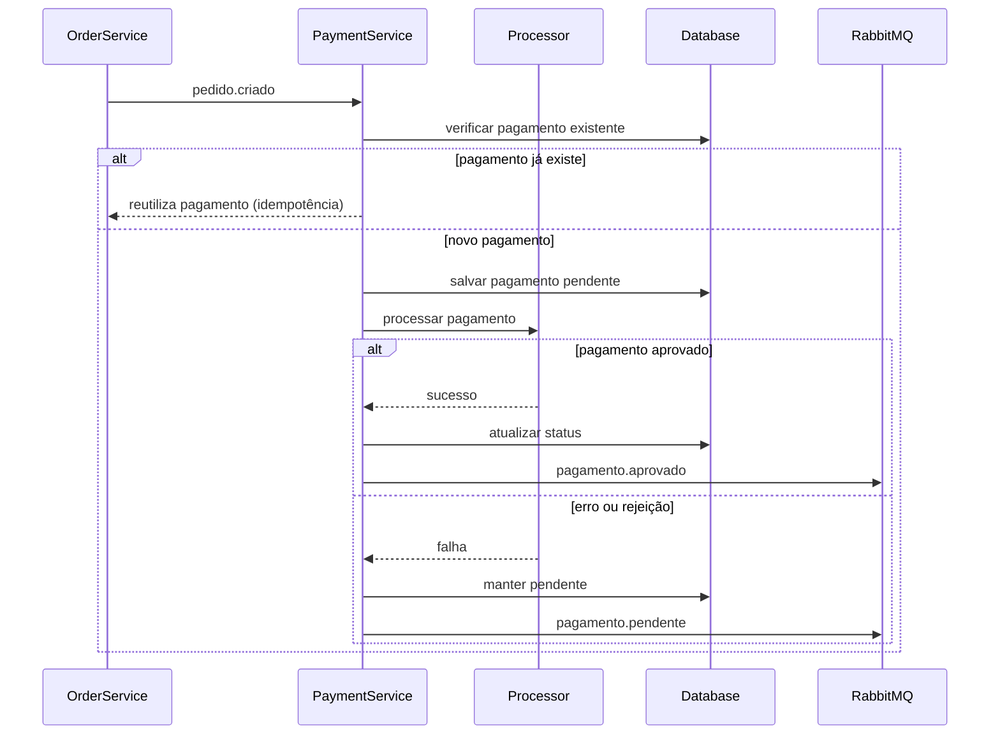

# 📦 Payment Service – FIAP Restaurant

Microsserviço responsável pelo **processamento de pagamentos** no ecossistema **Restaurant FIAP**.

O serviço consome eventos de criação de pedidos, processa o pagamento através de um processador externo e publica eventos informando o resultado do pagamento.

O projeto foi desenvolvido seguindo princípios de **Clean Architecture**, **Event-Driven Architecture** e boas práticas modernas de microsserviços.

---

# 🏗 Arquitetura

O serviço segue os princípios da **Clean Architecture (Robert C. Martin)**, garantindo:

- baixo acoplamento
- alta testabilidade
- independência de frameworks
- separação clara entre domínio e infraestrutura

As dependências sempre apontam **para o domínio**.

---

## 📐 Clean Architecture Diagram

```mermaid
flowchart TB

Frameworks[Spring Boot / RabbitMQ / PostgreSQL]

Adapters[Interface Adapters]
UseCases[Use Cases]
Entities[Domain Entities]

Frameworks --> Adapters
Adapters --> UseCases
UseCases --> Entities
````

---

# 📡 Arquitetura Orientada a Eventos

O sistema utiliza **mensageria assíncrona** para comunicação entre microsserviços.

```mermaid
flowchart LR

OrderService -->|pedido.criado| PaymentService

PaymentService -->|HTTP| ExternalProcessor
PaymentService -->|persistência| PostgreSQL

PaymentService -->|pagamento.aprovado| RabbitMQ
PaymentService -->|pagamento.pendente| RabbitMQ

RabbitMQ --> OrderService
RabbitMQ --> OtherServices
```

---

# 🔄 Fluxo de Processamento do Pagamento



---

# 🌐 Integração com Processador de Pagamentos

O serviço integra com um **processador externo de pagamentos** disponibilizado no ambiente local (`procpag`).

Endpoints utilizados:

| Método | Endpoint                     |
| ------ | ---------------------------- |
| POST   | `/requisicao`                |
| GET    | `/requisicao/{pagamento_id}` |

Fluxo de integração:

1. O `payment-service` envia uma requisição de pagamento
2. O processador retorna `accepted`
3. O serviço consulta o status do pagamento
4. Quando o status retorna `pago`, o pagamento é marcado como `APPROVED`

Observações identificadas durante os testes reais:

* o campo `valor` deve ser enviado como **inteiro positivo**
* o processador pode apresentar **falhas intermitentes**
* falhas resultam em pagamentos **PENDING**

---

# 🔁 Retry de Pagamentos Pendentes

Pagamentos que permanecem com status `PENDING` são automaticamente **reprocessados por um scheduler**.

Fluxo:

1️⃣ pagamento falha no processador externo
2️⃣ status permanece `PENDING`
3️⃣ scheduler executa periodicamente
4️⃣ pagamento é reenviado ao processador
5️⃣ quando aprovado, status é atualizado para `APPROVED`

Configuração:

```yaml
app:
  payment:
    retry:
      scheduler:
        enabled: true
        fixed-delay-ms: 30000
```

---

# 📡 Eventos do Sistema

## Evento Consumido

### `pedido.criado`

```json
{
  "orderId": "uuid",
  "clientId": "uuid",
  "amount": 120.00
}
```

---

## Eventos Publicados

### `pagamento.aprovado`

```json
{
  "paymentId": "uuid",
  "orderId": "uuid",
  "clientId": "uuid",
  "amount": 120.00,
  "status": "APPROVED",
  "occurredAt": "timestamp"
}
```

---

### `pagamento.pendente`

```json
{
  "paymentId": "uuid",
  "orderId": "uuid",
  "clientId": "uuid",
  "amount": 120.00,
  "status": "PENDING",
  "occurredAt": "timestamp"
}
```

---

# 🧠 Regras de Negócio

Fluxo de pagamento:

1️⃣ Recebe evento `pedido.criado`

2️⃣ Verifica se já existe pagamento para o pedido
(**idempotência por orderId**)

3️⃣ Caso não exista:

* cria pagamento com status `PENDING`
* chama processador externo

4️⃣ Se aprovado:

* atualiza status para `APPROVED`
* publica evento `pagamento.aprovado`

5️⃣ Caso ocorra erro ou rejeição:

* mantém pagamento `PENDING`
* publica evento `pagamento.pendente`

6️⃣ pagamentos pendentes serão **reprocessados automaticamente pelo scheduler**

---

# 📊 Observabilidade

O serviço possui integração com **Micrometer** para métricas operacionais.

| Métrica                         | Descrição                     |
| ------------------------------- | ----------------------------- |
| payment.approved.total          | total de pagamentos aprovados |
| payment.pending.total           | total de pagamentos pendentes |
| payment.idempotent.reused.total | pagamentos reaproveitados     |
| payment.processing.duration     | tempo de processamento        |

---

# 🗄 Banco de Dados

Migration inicial:

```
src/main/resources/db/migration/V1__init.sql
```

```sql
create table payments (
  id uuid primary key,
  order_id uuid not null,
  client_id uuid not null,
  status varchar(30) not null,
  amount numeric(19,2) not null,
  created_at timestamptz not null,
  updated_at timestamptz not null
);
```

Índices:

```
uk_payments_order_id
idx_payments_client_id
```

O schema é versionado com **Flyway**.

Hibernate está configurado apenas para **validação**.

---

# 🧪 Cenários Validados

Durante os testes integrados do serviço foram validados os seguintes cenários:

* consumo do evento `pedido.criado`
* persistência do pagamento no PostgreSQL
* integração HTTP real com o processador externo
* publicação do evento `pagamento.aprovado`
* tratamento de falhas com status `PENDING`
* reprocessamento automático de pagamentos pendentes
* idempotência por `orderId`

---

# 🛠 Stack Tecnológica

| Tecnologia      | Uso                     |
| --------------- | ----------------------- |
| Java 21         | Linguagem               |
| Spring Boot     | Framework               |
| Spring Data JPA | Persistência            |
| PostgreSQL      | Banco de dados          |
| Flyway          | Versionamento de schema |
| RabbitMQ        | Mensageria              |
| Micrometer      | Observabilidade         |
| Docker          | Containers              |
| Maven           | Build                   |
| GitHub Actions  | CI/CD                   |

---

# 📂 Estrutura do Projeto

```
src/main/java/br/com/fiap/restaurant/payment

core
 ├── domain
 │   └── model
 ├── gateway
 └── usecase

infra
 ├── client
 ├── config
 ├── messaging
 │   ├── inbound
 │   └── outbound
 ├── persistence
 └── observability
```

---

# 🐳 Execução Local

Subir infraestrutura:

```
docker compose up -d
```

Serviços disponíveis:

| Serviço                    | Porta |
| -------------------------- | ----- |
| PostgreSQL                 | 5432  |
| RabbitMQ                   | 5672  |
| RabbitMQ UI                | 15672 |
| External Payment Processor | 8089  |

RabbitMQ UI:

```
http://localhost:15672
```

---

Executar aplicação:

```
mvn spring-boot:run
```

Aplicação disponível em:

```
http://localhost:8083
```

---

# 🧪 Testes

Executar testes:

```
mvn test
```

Build completo:

```
mvn verify
```

---

# 🔄 Integração Contínua

Pipeline localizado em:

```
.github/workflows/ci.yml
```

Etapas do pipeline:

* setup Java 21
* subir PostgreSQL
* executar migrations Flyway
* executar testes
* validar build

---

# 🧭 Architecture Decision Records

## ADR-001 — Clean Architecture

O serviço segue **Clean Architecture** para separar domínio, casos de uso e infraestrutura.

Benefícios:

* baixo acoplamento
* alta testabilidade
* facilidade de evolução

---

## ADR-002 — Comunicação Assíncrona

A comunicação entre microsserviços utiliza **RabbitMQ** para garantir:

* desacoplamento
* resiliência
* escalabilidade

---

## ADR-003 — Idempotência

Pagamentos são **idempotentes por orderId**, evitando:

* pagamentos duplicados
* inconsistências em cenários concorrentes

---


