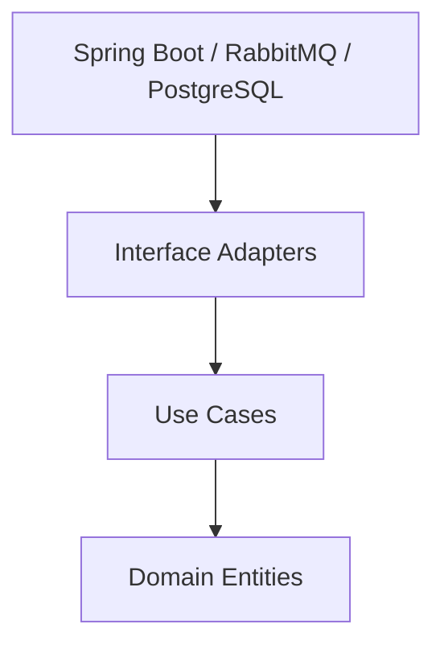
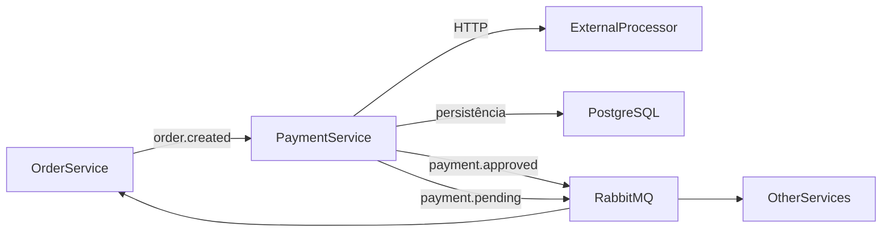

# 📦 Payment Service – FIAP Restaurant

Microsserviço responsável pelo **processamento de pagamentos** no ecossistema **Restaurant FIAP**.

O serviço consome eventos de criação de pedidos, processa o pagamento por meio de um processador externo e publica eventos informando o resultado do pagamento.

O projeto foi desenvolvido com foco em:

- **Clean Architecture**
- **Event-Driven Architecture**
- **resiliência**
- **idempotência**
- **testabilidade**
- **separação clara entre domínio e infraestrutura**

---

# 📑 Sumário

- [📦 Payment Service – FIAP Restaurant](#-payment-service--fiap-restaurant)
- [📑 Sumário](#-sumário)
- [🎯 Objetivo do Serviço](#-objetivo-do-serviço)
- [🏗 Arquitetura](#-arquitetura)
    - [📐 Clean Architecture Diagram](#-clean-architecture-diagram)
- [📡 Arquitetura Orientada a Eventos](#-arquitetura-orientada-a-eventos)
    - [🐇 Topologia RabbitMQ](#-topologia-rabbitmq)
- [🔄 Fluxo de Processamento do Pagamento](#-fluxo-de-processamento-do-pagamento)
- [🌐 API HTTP](#-api-http)
    - [Endpoints disponíveis](#endpoints-disponíveis)
    - [Exemplos cURL](#exemplos-curl)
- [🌐 Integração com Processador de Pagamentos](#-integração-com-processador-de-pagamentos)
- [🛡 Resiliência](#-resiliência)
- [🔁 Retry de Pagamentos Pendentes](#-retry-de-pagamentos-pendentes)
- [📡 Eventos do Sistema](#-eventos-do-sistema)
    - [Evento Consumido](#evento-consumido)
    - [Eventos Publicados](#eventos-publicados)
- [🧠 Regras de Negócio](#-regras-de-negócio)
    - [Idempotência](#idempotência)
- [📊 Observabilidade](#-observabilidade)
- [🗄 Banco de Dados](#-banco-de-dados)
- [🧪 Cenários Validados](#-cenários-validados)
- [🛠 Stack Tecnológica](#-stack-tecnológica)
- [📂 Estrutura do Projeto](#-estrutura-do-projeto)
- [🐳 Execução Local](#-execução-local)
    - [Pré-requisitos](#pré-requisitos)
    - [Subida local passo a passo](#subida-local-passo-a-passo)
- [⚙ Configuração Principal](#-configuração-principal)
- [🧪 Testes](#-testes)
- [🔄 Integração Contínua](#-integração-contínua)
- [🧭 Architecture Decision Records](#-architecture-decision-records)

---

# 🎯 Objetivo do Serviço

O `payment-service` é responsável por:

- consumir eventos de criação de pedido
- iniciar o processamento do pagamento
- persistir o estado do pagamento
- consultar pagamentos por `orderId`
- publicar eventos com o resultado do pagamento
- evitar duplicidade de processamento
- lidar com falhas transitórias do processador externo
- reprocessar pagamentos pendentes

---

# 🏗 Arquitetura

O serviço segue os princípios da **Clean Architecture (Robert C. Martin)**, garantindo:

- baixo acoplamento
- alta testabilidade
- independência de frameworks
- separação clara entre domínio, casos de uso e infraestrutura

As dependências sempre apontam **para o domínio**.

---

## 📐 Clean Architecture Diagram



---

# 📡 Arquitetura Orientada a Eventos

O sistema utiliza **mensageria assíncrona** com **RabbitMQ** para comunicação entre microsserviços.



---

## 🐇 Topologia RabbitMQ

### Exchanges
- `ex.order`
- `ex.payment`

### Routing keys
- `order.created`
- `payment.approved`
- `payment.pending`

### Queue consumida pelo `payment-service`
- `payment.order.created`

### Queues auxiliares / debug
- `payment.approved.debug`
- `payment.pending.debug`

### Dead Letter Queues
- `payment.order.created.dlq`
- `payment.approved.debug.dlq`
- `payment.pending.debug.dlq`

---

# 🔄 Fluxo de Processamento do Pagamento


---

# 🌐 API HTTP

O serviço também expõe endpoints REST para processamento manual e consulta de pagamentos.

## Endpoints disponíveis

| Método | Endpoint                    | Descrição |
| ------ | --------------------------- | --------- |
| POST   | `/payments/process`         | Processa um pagamento |
| GET    | `/payments/order/{orderId}` | Busca pagamento por `orderId` |

---

## Exemplos cURL

### Processar pagamento

```bash
curl -X POST http://localhost:8083/payments/process \
  -H "Content-Type: application/json" \
  -d '{
    "orderId": 12345,
    "clientId": "550e8400-e29b-41d4-a716-446655440001",
    "amount": 120.00
  }'
```

### Buscar pagamento por `orderId`

```bash
curl http://localhost:8083/payments/order/12345
```

### Exemplo de resposta

```json
{
  "paymentId": "550e8400-e29b-41d4-a716-446655440010",
  "orderId": 12345,
  "clientId": "550e8400-e29b-41d4-a716-446655440001",
  "amount": 120.00,
  "status": "APPROVED",
  "createdAt": "2026-03-20T12:00:00Z",
  "updatedAt": "2026-03-20T12:00:01Z"
}
```

### Exemplo de erro de validação

```json
{
  "amount": "amount deve ser maior que zero",
  "clientId": "clientId é obrigatório",
  "orderId": "orderId é obrigatório"
}
```

### Exemplo de pagamento não encontrado

```json
{
  "error": "Payment not found for orderId: 99999"
}
```

## Tratamento de erros

O serviço possui tratamento global de exceções para:

- `PaymentNotFoundException` → `404 Not Found`
- `IllegalArgumentException` → `400 Bad Request`
- `MethodArgumentNotValidException` → `400 Bad Request`

---

# 🌐 Integração com Processador de Pagamentos

O serviço integra com um **processador externo de pagamentos** disponibilizado no ambiente local (`procpag`).

## Endpoints utilizados

| Método | Endpoint                     |
| ------ | ---------------------------- |
| POST   | `/requisicao`                |
| GET    | `/requisicao/{pagamento_id}` |

## Fluxo de integração

1. o `payment-service` envia uma requisição de pagamento
2. o processador retorna `accepted`
3. o serviço consulta o status do pagamento
4. quando o status retorna `pago`, o pagamento é marcado como `APPROVED`

## Observações importantes

- o campo `valor` é enviado ao `procpag` como **inteiro positivo**
- o processador pode apresentar **falhas intermitentes**
- falhas ou indisponibilidades resultam em pagamentos **PENDING**
- existe suporte a client fake controlado por configuração (`app.external-payment.fake-enabled`)

---

# 🛡 Resiliência

A integração com o processador externo utiliza **Resilience4j** com as seguintes estratégias:

- **Retry**
- **Circuit Breaker**
- **Bulkhead**
- **TimeLimiter**

## Configuração base

```yaml
resilience4j:
  retry:
    instances:
      externalPaymentProcessor:
        max-attempts: 3
        wait-duration: 500ms

  circuitbreaker:
    instances:
      externalPaymentProcessor:
        sliding-window-size: 10
        minimum-number-of-calls: 5
        failure-rate-threshold: 50
        wait-duration-in-open-state: 10s
        permitted-number-of-calls-in-half-open-state: 3

  timelimiter:
    instances:
      externalPaymentProcessor:
        timeout-duration: 2s

  bulkhead:
    instances:
      externalPaymentProcessor:
        max-concurrent-calls: 5
        max-wait-duration: 0
```

---

# 🔁 Retry de Pagamentos Pendentes

O projeto possui suporte ao **reprocessamento de pagamentos pendentes** por meio de caso de uso dedicado e agendamento configurável.

## Fluxo esperado

1. o pagamento falha no processador externo
2. o status permanece `PENDING`
3. o mecanismo de retry busca pagamentos pendentes
4. o pagamento é reenviado ao processador externo
5. quando aprovado, o status é atualizado para `APPROVED`
6. um novo evento é publicado com o resultado

## Configuração

```yaml
app:
  payment:
    retry:
      scheduler:
        enabled: true
        fixed-delay-ms: 30000
```

---

# 📡 Eventos do Sistema

## Evento Consumido

### `order.created`

```json
{
  "messageId": "550e8400-e29b-41d4-a716-446655440000",
  "orderId": 12345,
  "clientId": "550e8400-e29b-41d4-a716-446655440001",
  "amount": 120.00
}
```

---

## Eventos Publicados

### `payment.approved`

```json
{
  "paymentId": "550e8400-e29b-41d4-a716-446655440010",
  "orderId": 12345,
  "clientId": "550e8400-e29b-41d4-a716-446655440001",
  "amount": 120.00,
  "status": "APPROVED",
  "occurredAt": "2026-03-20T12:00:00Z"
}
```

### `payment.pending`

```json
{
  "paymentId": "550e8400-e29b-41d4-a716-446655440011",
  "orderId": 12345,
  "clientId": "550e8400-e29b-41d4-a716-446655440001",
  "amount": 120.00,
  "status": "PENDING",
  "occurredAt": "2026-03-20T12:00:00Z"
}
```

---

# 🧠 Regras de Negócio

Fluxo principal do pagamento:

1. recebe evento `order.created`
2. verifica se já existe pagamento para o pedido
3. se já existir, reutiliza o pagamento existente
4. se não existir:
    - cria pagamento com status `PENDING`
    - persiste o pagamento
    - chama o processador externo
5. se aprovado:
    - atualiza status para `APPROVED`
    - publica evento `payment.approved`
6. caso ocorra erro, rejeição ou indisponibilidade:
    - mantém pagamento `PENDING`
    - publica evento `payment.pending`

---

## Idempotência

O serviço possui duas camadas principais de proteção contra duplicidade:

### 1. Idempotência por `orderId`
A tabela `payments` possui restrição única em `order_id`, evitando mais de um pagamento para o mesmo pedido.

### 2. Idempotência no consumo de eventos
O evento consumido possui `messageId`, e o serviço registra mensagens processadas na tabela `processed_messages`, evitando reprocessamento do mesmo evento.

---

# 📊 Observabilidade

O serviço possui integração com **Micrometer** e **Spring Boot Actuator** para métricas operacionais e logs de processamento.

## Métricas registradas

| Métrica                          | Descrição |
| -------------------------------- | --------- |
| `payment.approved.total`         | total de pagamentos aprovados |
| `payment.pending.total`          | total de pagamentos pendentes |
| `payment.idempotent.reused.total`| pagamentos reaproveitados por idempotência |
| `payment.processing.duration`    | duração do processamento de pagamentos |

## Logs relevantes

O serviço registra logs para:

- início do processamento
- reaproveitamento por idempotência
- reaproveitamento por concorrência
- início da chamada ao processador externo
- aprovação
- pendência
- erro externo

---

# 🗄 Banco de Dados

## Migration inicial

```text
src/main/resources/db/migration/V1__init.sql
```

```sql
create table payments (
  id uuid primary key,
  order_id bigint not null,
  client_id uuid not null,
  status varchar(30) not null,
  amount numeric(19,2) not null,
  created_at timestamptz not null,
  updated_at timestamptz not null
);

create unique index uk_payments_order_id on payments(order_id);
create index idx_payments_client_id on payments(client_id);
```

## Migration de idempotência

```text
src/main/resources/db/migration/V2__create_processed_messages.sql
```

```sql
create table processed_messages (
  message_id uuid primary key,
  message_type varchar(100) not null,
  aggregate_key varchar(255) not null,
  processed_at timestamptz not null
);

create index idx_processed_messages_aggregate_key
    on processed_messages (aggregate_key);
```

O schema é versionado com **Flyway**.

Hibernate está configurado para **validação** do schema.

---

# 🧪 Cenários Validados

Durante os testes do serviço, já foram validados cenários como:

- processamento de pagamento via API HTTP
- busca de pagamento por `orderId`
- validação de payload HTTP
- tratamento de pagamento não encontrado
- consumo do evento `order.created`
- idempotência de mensagens consumidas por `messageId`
- persistência do pagamento no PostgreSQL
- idempotência por `orderId`
- publicação do evento `payment.approved`
- publicação do evento `payment.pending`
- integração HTTP com o processador externo
- retry do processador externo
- circuit breaker
- bulkhead
- reprocessamento de pagamentos pendentes

---

# 🛠 Stack Tecnológica

| Tecnologia                                 | Uso |
| ------------------------------------------ | --- |
| Java 21                                    | Linguagem |
| Spring Boot 4.0.3                          | Framework principal |
| Spring Web                                 | API HTTP |
| Spring Data JPA                            | Persistência |
| Spring AMQP                                | Integração com RabbitMQ |
| Spring Validation                          | Validação de requests |
| Spring Boot Actuator                       | Observabilidade |
| PostgreSQL                                 | Banco de dados |
| Flyway                                     | Versionamento de schema |
| RabbitMQ                                   | Mensageria |
| Micrometer                                 | Métricas |
| Spring Cloud CircuitBreaker + Resilience4j | Resiliência |
| Docker / Docker Compose                    | Infraestrutura local |
| Maven                                      | Build |
| JUnit 5 / Mockito / Spring Boot Test       | Testes |

---

# 📂 Estrutura do Projeto

```text
src/main/java/br/com/fiap/restaurant/payment

core
 ├── domain
 │   ├── exception
 │   └── model
 ├── gateway
 └── usecase
     └── command

infra
 ├── client
 │   ├── adapter
 │   └── processor
 ├── config
 ├── controller
 │   ├── handler
 │   ├── mapper
 │   ├── request
 │   └── response
 ├── messaging
 │   ├── config
 │   ├── inbound
 │   └── outbound
 ├── observability
 │   └── adapter
 └── persistence
     ├── adapter
     ├── entity
     └── repository
```

---

# 🐳 Execução Local

## Pré-requisitos

Antes de executar o projeto, garanta que você tenha instalado:

- Java 21
- Maven 3.9+
- Docker
- Docker Compose

---

## Subida local passo a passo

### 1. Subir a infraestrutura

```bash
docker compose up -d
```

### 2. Verificar containers

```bash
docker ps
```

### 3. Confirmar serviços disponíveis

| Serviço                    | Porta |
| -------------------------- | ----- |
| PostgreSQL                 | 5432  |
| RabbitMQ                   | 5672  |
| RabbitMQ Management UI     | 15672 |
| External Payment Processor | 8089  |

### 4. Acessar o RabbitMQ Management

```text
http://localhost:15672
```

Credenciais padrão:

```text
guest / guest
```

### 5. Executar a aplicação

```bash
mvn spring-boot:run
```

### 6. Validar subida da aplicação

Base URL local:

```text
http://localhost:8083
```

### 7. Testar rapidamente a API

```bash
curl http://localhost:8083/payments/order/12345
```

---

# ⚙ Configuração Principal

```yaml
spring:
  datasource:
    url: jdbc:postgresql://localhost:5432/paymentdb
    username: payment
    password: payment

  rabbitmq:
    host: localhost
    port: 5672
    username: guest
    password: guest

app:
  rabbit:
    exchange:
      order: ex.order
      payment: ex.payment
    routing-key:
      order-created: order.created
      payment-approved: payment.approved
      payment-pending: payment.pending
    queue:
      payment-order-created: payment.order.created

  payment:
    retry:
      scheduler:
        enabled: true
        fixed-delay-ms: 30000

  external-payment:
    fake-enabled: false
    base-url: http://localhost:8089
    request-path: /requisicao
```

---

# 🧪 Testes

## Executar todos os testes

```bash
mvn test
```

## Executar build completo

```bash
mvn verify
```

## Executar um teste específico

```bash
mvn -Dtest=PaymentControllerTest test
```

---

# 🔄 Integração Contínua

Pipeline localizado em:

```text
.github/workflows/ci.yml
```

Etapas do pipeline:

- setup do Java 21
- subida dos serviços necessários
- execução das migrations
- execução da suíte de testes
- validação do build

---

# 🧭 Architecture Decision Records

## ADR-001 — Clean Architecture

O serviço segue **Clean Architecture** para separar domínio, casos de uso e infraestrutura.

### Benefícios
- baixo acoplamento
- alta testabilidade
- facilidade de evolução

---

## ADR-002 — Comunicação Assíncrona com RabbitMQ

A comunicação entre microsserviços utiliza **RabbitMQ** para garantir:

- desacoplamento
- resiliência
- escalabilidade

---

## ADR-003 — Idempotência

O serviço adota idempotência em dois níveis:

- por `orderId`, evitando múltiplos pagamentos para o mesmo pedido
- por `messageId`, evitando reprocessamento do mesmo evento consumido

---

## ADR-004 — Resiliência na Integração Externa

A comunicação com o processador externo utiliza mecanismos de resiliência para reduzir impacto de falhas transitórias e indisponibilidade parcial:

- retry
- circuit breaker
- bulkhead
- time limiter
