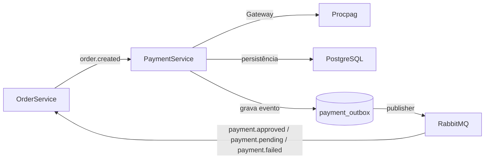
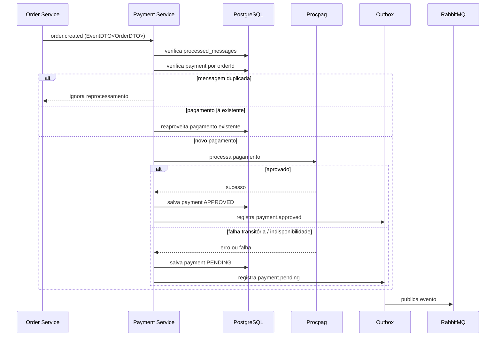
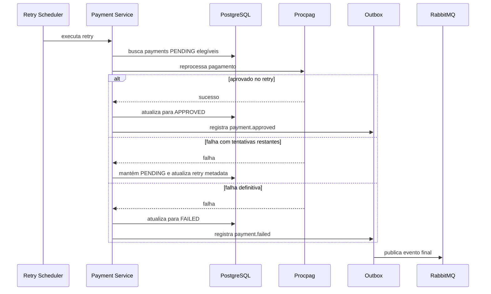
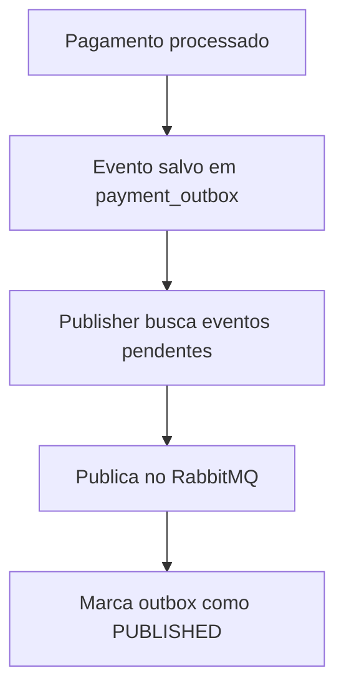

# Payment Service

Microsserviço responsável pelo processamento de pagamentos no ecossistema **FIAP Restaurant**.

O serviço consome eventos de criação de pedido, processa pagamentos com um provedor externo, persiste o estado do pagamento, registra eventos em **outbox** e publica o resultado final no **RabbitMQ**.

## Principais características

- Clean Architecture
- Event-Driven Architecture
- Outbox Pattern
- Idempotência
- Resiliência com Resilience4j
- PostgreSQL + Flyway
- RabbitMQ
- Testcontainers nos testes de integração

---

# Visão geral

O `payment-service` é responsável por:

- consumir o evento `order.created`
- calcular o valor total do pedido a partir dos itens recebidos
- criar ou reaproveitar o pagamento do pedido
- integrar com o processador externo de pagamentos
- persistir o pagamento no PostgreSQL
- registrar eventos de saída em outbox
- publicar eventos finais de pagamento no RabbitMQ
- evitar reprocessamento da mesma mensagem

---

# Arquitetura

O projeto segue os princípios da **Clean Architecture**, separando claramente:

- **Domínio**: entidades, regras de negócio e contratos
- **Casos de uso**: orquestração da lógica de aplicação
- **Infraestrutura**: banco, mensageria, cliente HTTP, controllers e configuração

## Estrutura

```text
src/main/java/br/com/fiap/restaurant/payment

core
 ├── domain
 │   ├── exception
 │   └── model
 ├── gateway
 └── usecase
     └── command

infra
 ├── client
 ├── config
 ├── controller
 ├── messaging
 ├── observability
 ├── persistence
 └── scheduler
````

---

# Fluxos do sistema

## Fluxo macro



## Fluxo principal de processamento



## Fluxo de retry de pagamentos pendentes



## Fluxo de publicação via outbox



---

# Contrato de entrada

O serviço consome a routing key `order.created`, com payload no formato:

## `EventDTO<OrderDTO>`

```json
{
  "uuid": "550e8400-e29b-41d4-a716-446655440000",
  "type": "ORDER_CREATED",
  "createTimeStamp": "2026-03-22T20:01:26.110425900",
  "body": {
    "id": 12345,
    "customerUuid": "550e8400-e29b-41d4-a716-446655440001",
    "items": [
      {
        "quantity": 1,
        "unitPrice": 120.00
      }
    ]
  }
}
```

## Observação importante

O `payment-service` **não recebe o total pronto** no evento.
O valor do pagamento é derivado a partir dos itens presentes em `body.items`.

---

# Eventos publicados

Os eventos de saída são publicados envelopados em:

## `EventDTO<PaymentEventMessage>`

### `payment.approved`

```json
{
  "uuid": "550e8400-e29b-41d4-a716-446655440100",
  "type": "payment.approved",
  "createTimeStamp": "2026-03-20T12:00:00",
  "body": {
    "paymentId": "550e8400-e29b-41d4-a716-446655440010",
    "orderId": 12345,
    "clientId": "550e8400-e29b-41d4-a716-446655440001",
    "amount": 120.00,
    "status": "APPROVED",
    "occurredAt": "2026-03-20T12:00:00Z"
  }
}
```

### `payment.pending`

```json
{
  "uuid": "550e8400-e29b-41d4-a716-446655440101",
  "type": "payment.pending",
  "createTimeStamp": "2026-03-20T12:00:00",
  "body": {
    "paymentId": "550e8400-e29b-41d4-a716-446655440011",
    "orderId": 12345,
    "clientId": "550e8400-e29b-41d4-a716-446655440001",
    "amount": 120.00,
    "status": "PENDING",
    "occurredAt": "2026-03-20T12:00:00Z"
  }
}
```

### `payment.failed`

```json
{
  "uuid": "550e8400-e29b-41d4-a716-446655440102",
  "type": "payment.failed",
  "createTimeStamp": "2026-03-20T12:00:00",
  "body": {
    "paymentId": "550e8400-e29b-41d4-a716-446655440012",
    "orderId": 12345,
    "clientId": "550e8400-e29b-41d4-a716-446655440001",
    "amount": 120.00,
    "status": "FAILED",
    "occurredAt": "2026-03-20T12:00:00Z"
  }
}
```

---

# Topologia RabbitMQ

## Exchanges

* `ex.order`
* `ex.order.dlx`
* `ex.payment`
* `ex.payment.dlx`

## Routing keys

* `order.created`
* `payment.approved`
* `payment.pending`
* `payment.failed`

## Fila consumida pelo serviço

* `payment.order.created`

## Filas de debug

* `payment.approved.debug`
* `payment.pending.debug`
* `payment.failed.debug`

## Dead Letter Queues

* `payment.order.created.dlq`
* `payment.approved.debug.dlq`
* `payment.pending.debug.dlq`
* `payment.failed.debug.dlq`

---

# API HTTP

Além do fluxo assíncrono, o serviço expõe endpoints REST para operação manual e consulta.

## Endpoints

| Método | Endpoint                    | Descrição                     |
| ------ | --------------------------- | ----------------------------- |
| POST   | `/payments/process`         | Processa um pagamento         |
| GET    | `/payments/order/{orderId}` | Consulta pagamento por pedido |

## Exemplo de processamento

```bash
curl -X POST http://localhost:8083/payments/process \
  -H "Content-Type: application/json" \
  -d '{
    "orderId": 12345,
    "clientId": "550e8400-e29b-41d4-a716-446655440001",
    "amount": 120.00
  }'
```

---

# Idempotência

A solução protege o fluxo contra duplicidade em múltiplos níveis.

## 1. Idempotência por mensagem

O evento de entrada possui identificador no envelope (`uuid`).

Esse identificador é registrado na tabela `processed_messages`, impedindo reprocessamento do mesmo evento.

## 2. Idempotência por pedido

A tabela `payments` possui restrição única para `order_id`, evitando múltiplos pagamentos para o mesmo pedido.

## 3. Reaproveitamento em concorrência

Em cenários concorrentes, o serviço reaproveita o pagamento persistido pelo fluxo vencedor.

---

# Outbox Pattern

A publicação de eventos não ocorre diretamente no mesmo ponto em que a decisão de negócio é tomada.

Em vez disso:

1. o pagamento é persistido
2. o evento é gravado em `payment_outbox`
3. um publisher dedicado lê os eventos pendentes
4. publica no RabbitMQ
5. atualiza o status do outbox para `PUBLISHED`

## Benefícios

* maior confiabilidade no fluxo assíncrono
* menor acoplamento entre banco e broker
* melhor rastreabilidade
* suporte mais seguro a retry de publicação

---

# Resiliência

A integração com o processador externo utiliza **Resilience4j**, com:

* Retry
* Circuit Breaker
* Bulkhead
* TimeLimiter

A execução resiliente é feita com isolamento apropriado para chamadas externas, reduzindo impacto de falhas transitórias e indisponibilidade parcial.

---

# Retry de pagamentos pendentes

Quando a chamada ao processador externo falha, o pagamento pode permanecer em `PENDING` e ser reprocessado depois.

## Comportamento

* falha transitória → pagamento segue como `PENDING`
* reprocessamento automático → tenta novamente
* sucesso posterior → `APPROVED`
* esgotamento do limite → `FAILED`

## Configuração padrão

```yaml
app:
  payment:
    retry:
      scheduler:
        enabled: true
        fixed-delay-ms: 30000
      policy:
        max-attempts: 3
        publish-pending-on-retry-failure: false
```

---

# Contrato monetário

O domínio trabalha com `BigDecimal`, mantendo semântica correta para valores monetários.

## Regra adotada

* no domínio: valor monetário decimal
* na persistência: `numeric(19,2)`
* na integração com o processador externo: inteiro em centavos

## Exemplo

* `10.50` no domínio
* `1050` no payload externo

## Decisão

A conversão para centavos acontece **somente na borda de integração** com o processador externo.

Isso evita:

* perda de precisão
* truncagem silenciosa
* inconsistência entre domínio, persistência e auditoria

---

# Banco de dados

O schema é versionado com **Flyway**.

## Principais estruturas

* `payments`
* `processed_messages`
* `payment_outbox`

## Objetivos

* persistir o estado do pagamento
* registrar idempotência
* suportar retry
* armazenar eventos pendentes de publicação

---

# Observabilidade

O serviço possui suporte a métricas e logs operacionais com **Micrometer** e **Spring Boot Actuator**.

## Exemplos de métricas

* `payment.approved.total`
* `payment.pending.total`
* `payment.failed.total`
* `payment.idempotent.reused.total`
* `payment.processing.duration`

## Exemplos de logs relevantes

* início do processamento
* reaproveitamento por idempotência
* chamada ao processador externo
* aprovação
* pendência
* falha definitiva
* execução do retry
* publicação do outbox

---

# Estratégia de testes

A suíte cobre:

* testes unitários
* testes de controller
* testes de persistência
* testes de integração com mensageria
* testes de resiliência
* testes end-to-end

## Abordagem adotada

Os testes de integração usam infraestrutura real via **Testcontainers**:

* PostgreSQL real
* RabbitMQ real

Classes-base utilizadas:

* `AbstractPostgresIntegrationTest`
* `AbstractMessagingIntegrationTest`

Isso permite validar comportamento real de banco e broker sem alterar o código de produção.

---

# Execução local

## Pré-requisitos

* Java 21
* Maven 3.9+
* Docker
* Docker Compose

## Subir infraestrutura

```bash
docker compose up -d
```

## Serviços locais

| Serviço                | Porta |
| ---------------------- | ----- |
| PostgreSQL             | 5432  |
| RabbitMQ               | 5672  |
| RabbitMQ Management UI | 15672 |
| Procpag                | 8089  |

## Executar a aplicação

```bash
mvn spring-boot:run
```

## URL local

```text
http://localhost:8083
```

## RabbitMQ Management

```text
http://localhost:15672
```

Credenciais padrão:

```text
guest / guest
```

---

# Stack tecnológica

* Java 21
* Spring Boot 4
* Spring Web
* Spring Data JPA
* Spring AMQP
* Spring Validation
* Spring Boot Actuator
* PostgreSQL
* Flyway
* RabbitMQ
* Micrometer
* Resilience4j
* Docker / Docker Compose
* Testcontainers
* Maven
* JUnit 5 / Mockito / Spring Boot Test

---

# Decisões arquiteturais

## Clean Architecture

Separa domínio, aplicação e infraestrutura para manter o núcleo independente e testável.

## RabbitMQ

Usado para desacoplamento e comunicação assíncrona entre serviços.

## Idempotência

Aplicada por mensagem e por pedido para evitar duplicidade de processamento.

## Outbox Pattern

Garante maior confiabilidade entre persistência e publicação de eventos.

## Resiliência na integração externa

Protege o sistema contra falhas transitórias do processador externo.

## Contrato monetário com adaptação na borda

Mantém `BigDecimal` no domínio e converte para centavos apenas no cliente externo.

---

# Resumo

O `payment-service` foi construído para ser um microsserviço robusto, auditável e resiliente.

Ele combina:

* arquitetura limpa
* mensageria assíncrona
* persistência consistente
* idempotência
* outbox
* resiliência
* testes com infraestrutura real

O resultado é um serviço preparado para operar em cenários distribuídos com maior segurança técnica e previsibilidade operacional.

